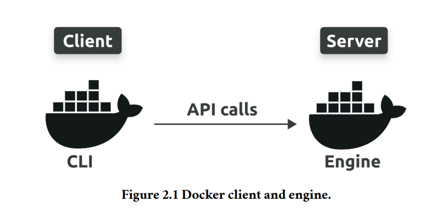
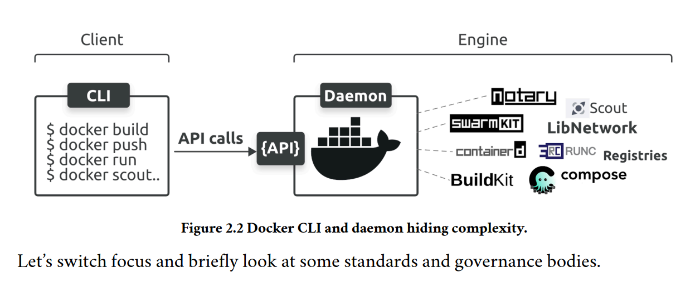

# Chapter 2 - Docker and container-related standards and projects

Docker is at the heart of the container ecosystem. However, the term Docker can mean
two things:

1. The Docker platform
2. Docker, Inc.

The Docker platform is a neatly packaged collection of technologies for creating, managing, and orchestrating containers. Docker, Inc. is the company that created the Docker
platform and continues to be the driving force behind developing new features.

Docker, Inc. is a technology company based out of Palo Alto and founded by Frenchborn American developer and entrepreneur Solomon Hykes. Solomon is no longer at
the company.

The word Docker is a British expression meaning dock work____er____ that refers to a
person who loads and unloads cargo from ships.

In 2013, dotCloud dropped the struggling PaaS side of the business, rebranded as
Docker, Inc., and focussed on bringing Docker and containers to the world.

### The Docker Technology

The Docker platform is designed to make it as easy as possible to build, ship, and run
containers.
At a high level, there are two major parts to the Docker platform:
• The CLI (client)
• The engine (server)

The CLI is the familiar docker command-line tool for deploying and managing containers. It converts simple commands into API requests and sends them to the engine.
The engine comprises all the server-side components that run and manage containers.

you type friendly docker commands into the CLI, the CLI converts them to
API requests and sends them to the daemon, and the daemon takes care of everything
else.

